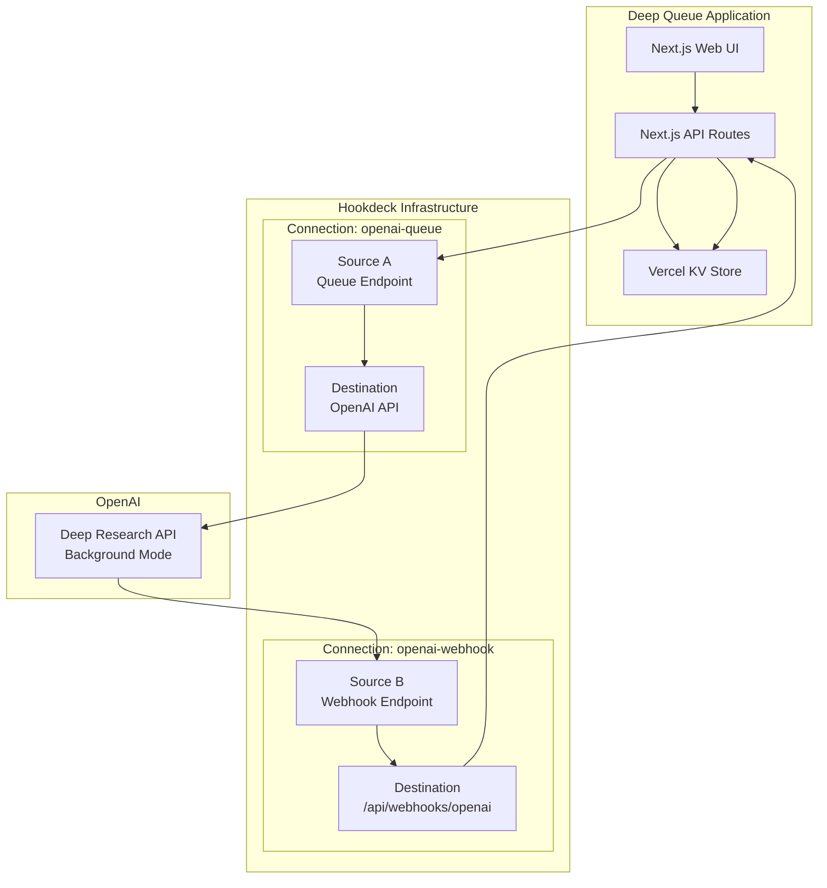

# Deep Queue: OpenAI Deep Research + Hookdeck Integration Plan

## Overview

Deep Queue is a web application that demonstrates the power of combining OpenAI's Deep Research API with Hookdeck's webhook infrastructure. The application enables users to submit complex research questions to OpenAI's Deep Research service, which runs asynchronously in the background. Hookdeck manages both the outbound API requests (via queue) and inbound webhook responses, providing complete visibility into the entire research workflow.

## Architecture



## Tech Stack

| Component | Technology | Purpose |
|-----------|------------|---------|
| Language | TypeScript | Type-safe development throughout |
| Framework | Next.js 14+ (App Router) | Modern React framework with API routes |
| Authentication | NextAuth.js | Simple demo authentication |
| Data Store | Vercel KV | Serverless Redis for persistence |
| Event Gateway | Hookdeck Event Gateway | Event Gateway infrastructure for queuing and webhooks |
| AI Service | OpenAI Deep Research | Long-running research capabilities |
| Deployment | Vercel | Serverless deployment platform |
| Polling | SWR | Data fetching with automatic revalidation |
| MCP Server | Context7 (optional) | Access to Hookdeck documentation via MCP |

## Hookdeck Connections

Deep Queue uses two Hookdeck connections to manage the complete research workflow:

### 1. `openai-queue` Connection
- **Source**: HTTP endpoint that receives research requests from the application
- **Destination**: OpenAI API endpoint with authentication configured
- **Purpose**: Queues outbound API requests to OpenAI Deep Research
- **Benefits**: Rate limiting, retries, and request visibility

### 2. `openai-webhook` Connection
- **Source**: HTTP endpoint that receives webhooks from OpenAI
- **Destination**: Deep Queue's `/api/webhooks/openai` endpoint
- **Purpose**: Receives status updates and results from OpenAI
- **Benefits**: Webhook reliability, event replay, and debugging

## Runtime Initialization

The application dynamically creates Hookdeck connections on first use:

```typescript
// lib/hookdeck/initialize.ts
import { kv } from '@vercel/kv';
import crypto from 'crypto';

const HOOKDECK_API_URL = 'https://api.hookdeck.com/2025-07-01';
const HOOKDECK_API_KEY = process.env.HOOKDECK_API_KEY!;

// Generate secure basic auth credentials
function generateBasicAuth() {
  const username = 'deepqueue';
  const password = crypto.randomBytes(32).toString('base64');
  return { username, password, encoded: Buffer.from(`${username}:${password}`).toString('base64') };
}

export async function ensureHookdeckConnections() {
  // Check if connections already exist in KV
  const connections = await kv.get('hookdeck:connections');
  if (connections) return connections;

  // Generate basic auth for SourceA
  const basicAuth = generateBasicAuth();
  await kv.set('hookdeck:source-auth', basicAuth);
  
  // Create openai-queue connection with basic auth on source
  const queueResponse = await fetch(`${HOOKDECK_API_URL}/connections`, {
    method: 'POST',
    headers: {
      'Authorization': `Bearer ${HOOKDECK_API_KEY}`,
      'Content-Type': 'application/json'
    },
    body: JSON.stringify({
      name: 'openai-queue',
      source: {
        name: 'deepqueue-source',
        allowed_http_methods: ['POST'],
        custom_response: {
          content_type: 'application/json',
          body: '{"status":"queued"}'
        }
      },
      destination: {
        name: 'openai-api',
        url: 'https://api.openai.com/v1/deep-research',
        auth_method: {
          type: 'BEARER_TOKEN',
          config: {
            token: process.env.OPENAI_API_KEY!
          }
        }
      },
      rules: [{
        type: 'filter',
        body_json: {
          authorization: basicAuth.encoded
        }
      }]
    })
  });
  const queueConnection = await queueResponse.json();

  // Create openai-webhook connection with OpenAI source type
  const webhookResponse = await fetch(`${HOOKDECK_API_URL}/connections`, {
    method: 'POST',
    headers: {
      'Authorization': `Bearer ${HOOKDECK_API_KEY}`,
      'Content-Type': 'application/json'
    },
    body: JSON.stringify({
      name: 'openai-webhook',
      source: {
        name: 'openai-webhook-source',
        allowed_http_methods: ['POST'],
        verification: {
          type: 'OPENAI'
        }
      },
      destination: {
        name: 'deepqueue-webhook',
        url: `${process.env.NEXTAUTH_URL}/api/webhooks/openai`,
        auth_method: {
          type: 'HOOKDECK_SIGNATURE',
          config: {}
        }
      }
    })
  });
  const webhookConnection = await webhookResponse.json();

  // Store connection details in KV
  const connectionData = {
    queue: {
      id: queueConnection.id,
      sourceUrl: queueConnection.source.url
    },
    webhook: {
      id: webhookConnection.id,
      sourceUrl: webhookConnection.source.url
    }
  };

  await kv.set('hookdeck:connections', connectionData);
  return connectionData;
}
```

## User Interface

### 1. Login Page (`/login`)
- Simple username/password form
- Uses NextAuth.js for authentication
- Credentials stored in environment variables for demo

### 2. Dashboard (`/`)
```typescript
// app/page.tsx
export default function Dashboard() {
  const { data: researches } = useSWR('/api/researches');
  
  return (
    <div>
      <h1>Deep Queue Dashboard</h1>
      
      {/* Research Submission Form */}
      <form onSubmit={submitResearch}>
        <textarea 
          placeholder="Enter your research question..."
          rows={4}
        />
        <button type="submit">Start Research</button>
      </form>
      
      {/* Active Research List */}
      <div>
        <h2>Your Research Requests</h2>
        {researches?.map(research => (
          <ResearchCard key={research.id} research={research} />
        ))}
      </div>
    </div>
  );
}
```

### 3. Research Detail (`/research/[id]`)
Enhanced page with multiple sections:

```typescript
// app/research/[id]/page.tsx
export default function ResearchDetail({ params }) {
  const { data: research } = useSWR(`/api/researches/${params.id}`);
  const { data: events } = useSWR(`/api/researches/${params.id}/events`);
  
  return (
    <div>
      {/* Overview Section */}
      <section>
        <h1>Research Overview</h1>
        <div>Question: {research.question}</div>
        <div>Status: {research.status}</div>
        <ProgressBar progress={research.progress} />
        {research.results && <ResearchResults data={research.results} />}
      </section>
      
      {/* Events Timeline */}
      <section>
        <h2>Hookdeck Events Timeline</h2>
        <Timeline>
          {events?.map(event => (
            <TimelineEvent 
              key={event.id}
              event={event}
              type={event.connection === 'openai-queue' ? 'outbound' : 'inbound'}
            />
          ))}
        </Timeline>
      </section>
      
      {/* Download Section */}
      {research.completed && (
        <section>
          <button onClick={() => downloadResults(research.id)}>
            Download Research Results
          </button>
        </section>
      )}
    </div>
  );
}
```

### 4. About Page (`/about`)
- Overview of Deep Queue application
- Explanation of OpenAI Deep Research
- Introduction to Hookdeck's role
- Information about Vercel deployment

## Implementation Steps

### Phase 1: Project Setup
1. Initialize Next.js 14+ project with TypeScript
   ```bash
   npx create-next-app@latest deep-queue --typescript --app --tailwind
   cd deep-queue
   ```

2. Install dependencies
   ```bash
   npm install next-auth @vercel/kv @hookdeck/sdk swr
   npm install -D @types/node
   ```

3. Configure environment variables in `.env.local`

### Development Tools (Optional)
For enhanced development experience:
- **Context7 MCP Server**: Optional, required development environment change. Provides access to Hookdeck documentation during development
- **Hookdeck LLMs.txt**: Reference documentation optimized for AI assistants

### Phase 2: Authentication
1. Set up NextAuth.js with credentials provider
2. Create login page with form
3. Implement session management
4. Add authentication middleware

### Phase 3: Hookdeck Integration
1. Create runtime initialization module
2. Implement connection checking logic
3. Add KV storage for connection details
4. Create webhook endpoint handler

### Phase 4: Research Workflow
1. Create research submission API route
2. Implement Hookdeck queue integration
3. Create webhook handler for OpenAI responses
4. Store research data in Vercel KV

### Phase 5: Event Correlation
```typescript
// lib/events/correlate.ts
export async function getCorrelatedEvents(researchId: string) {
  const response = await fetch(
    `${HOOKDECK_API_URL}/events?` + new URLSearchParams({
      'body_json.research_id': researchId,
      'order_by': 'created_at',
      'dir': 'asc'
    }),
    {
      headers: {
        'Authorization': `Bearer ${process.env.HOOKDECK_API_KEY!}`
      }
    }
  );
  
  const events = await response.json();
  
  // Separate and correlate outbound/inbound
  const timeline = events.models
    .sort((a, b) => a.created_at - b.created_at)
    .map(event => ({
      id: event.id,
      type: event.source.name === 'deepqueue-source' ? 'outbound' : 'inbound',
      connection: event.connection.name,
      status: event.status,
      timestamp: event.created_at,
      data: event.data
    }));
    
  return timeline;
}
```

### Phase 6: UI Development
1. Create dashboard with research list
2. Build research detail page with tabs
3. Implement events timeline visualization
4. Add progress tracking and status updates
5. Create download functionality

### Phase 7: Deployment
1. Push to GitHub repository
2. Connect Vercel to GitHub
3. Configure environment variables in Vercel
4. Set up Vercel KV instance
5. Deploy application

## API Routes

### `/api/researches` (POST)
```typescript
export async function POST(request: Request) {
  const { question } = await request.json();
  const connections = await ensureHookdeckConnections();
  const basicAuth = await kv.get('hookdeck:source-auth');
  
  // Create research record
  const researchId = crypto.randomUUID();
  await kv.set(`research:${researchId}`, {
    id: researchId,
    question,
    status: 'pending',
    createdAt: Date.now()
  });
  
  // Send to Hookdeck queue with basic auth
  await fetch(connections.queue.source.url, {
    method: 'POST',
    headers: {
      'Content-Type': 'application/json',
      'Authorization': `Basic ${basicAuth.encoded}`
    },
    body: JSON.stringify({
      research_id: researchId,
      question,
      webhook_url: connections.webhook.source.url
    })
  });
  
  return Response.json({ id: researchId });
}
```

### `/api/webhooks/openai` (POST)
```typescript
import { verifyWebhookSignature } from '@/lib/hookdeck/verify';

export async function POST(request: Request) {
  // Verify the webhook came from Hookdeck
  const signature = request.headers.get('x-hookdeck-signature');
  const rawBody = await request.text();
  
  if (!verifyWebhookSignature(rawBody, signature!, process.env.HOOKDECK_SIGNING_SECRET!)) {
    return new Response('Unauthorized', { status: 401 });
  }
  
  const data = JSON.parse(rawBody);
  const { research_id, status, progress, results } = data;
  
  // Update research record
  const research = await kv.get(`research:${research_id}`);
  await kv.set(`research:${research_id}`, {
    ...research,
    status,
    progress,
    results,
    updatedAt: Date.now()
  });
  
  return Response.json({ success: true });
}
```

### Webhook Verification Helper
```typescript
// lib/hookdeck/verify.ts
import crypto from 'crypto';

export function verifyWebhookSignature(
  payload: string,
  signature: string,
  secret: string
): boolean {
  const hash = crypto
    .createHmac('sha256', secret)
    .update(payload)
    .digest('base64');
  
  return hash === signature;
}
```

## Environment Variables

```env
# OpenAI Configuration
OPENAI_API_KEY=sk-...

# Hookdeck Configuration
HOOKDECK_API_KEY=hk_...

# NextAuth Configuration
NEXTAUTH_SECRET=your-secret-key
NEXTAUTH_URL=https://your-app.vercel.app

# Demo Authentication
DEMO_USERNAME=demo
DEMO_PASSWORD=secure-password

# Vercel KV Configuration
KV_URL=redis://...
KV_REST_API_URL=https://...
KV_REST_API_TOKEN=...
```

## Key Features

1. **No Setup Required**: Hookdeck connections created automatically on first use
2. **Complete Visibility**: See every API request and webhook in the events timeline
3. **Correlation**: Track the full journey of each research request
4. **Progress Tracking**: Real-time updates via polling
5. **Download Results**: Export completed research
6. **Type Safety**: Full TypeScript implementation
7. **Production Ready**: Deployed on Vercel with KV storage

## Security Considerations

1. API keys stored securely in environment variables
2. Authentication required for all research operations
3. Webhook endpoint validates incoming requests
4. Rate limiting via Hookdeck's built-in features
5. HTTPS enforced throughout

## References

- [OpenAI Deep Research Documentation](https://platform.openai.com/docs/guides/deep-research#best-practices)
- [Hookdeck Connections Guide](https://hookdeck.com/docs/connections)
- [Next.js App Router](https://nextjs.org/docs/app)
- [Vercel KV Documentation](https://vercel.com/docs/storage/vercel-kv)
- [NextAuth.js Guide](https://next-auth.js.org/getting-started/introduction)

## Future Enhancements

1. Multiple user support with proper authentication
2. Research collaboration features
3. Custom webhook transformations
4. Advanced search and filtering
5. Export to various formats (PDF, Markdown, etc.)
6. Integration with other AI services
7. Real-time updates via WebSockets
8. Advanced analytics and metrics

## Conclusion

Deep Queue showcases how modern webhook infrastructure (Hookdeck) can elegantly handle complex async workflows like OpenAI's Deep Research API. By providing complete visibility into both outbound requests and inbound webhooks, developers can build reliable, debuggable AI applications with confidence.
