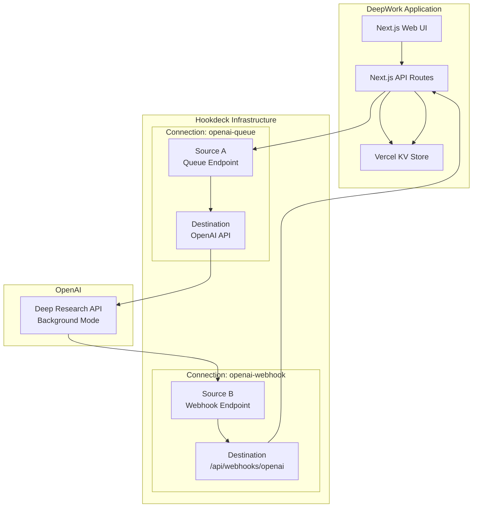

# DeepWork: OpenAI Deep Research + Hookdeck

DeepWork is a web application that demonstrates the power of combining OpenAI's Deep Research API with the Hookdeck Event Gateway to support highly reliable and scalable asynchronous workflows and background jobs.

The application enables users to submit complex research questions to OpenAI's Deep Research service, which runs asynchronously in the background. Hookdeck manages both the outbound API requests (via queue) and inbound webhook responses, providing complete visibility into the entire research workflow.

## Features

- **Asynchronous Research**: Submit long-running research tasks to OpenAI without blocking the UI.
- **Reliable Webhooks**: Hookdeck ensures reliable delivery of OpenAI's webhook responses.
- **Request Queuing**: Outbound requests to OpenAI are queued through Hookdeck for resilience and visibility.
- **Event Timeline**: View a detailed timeline of both outbound requests and inbound webhooks for each research task.
- **Simple Authentication**: A straightforward demo authentication system using NextAuth.js.
- **Serverless-first**: Built with Next.js and designed for deployment on Vercel.

## Architecture



## Tech Stack

| Component      | Technology               | Purpose                                               |
| -------------- | ------------------------ | ----------------------------------------------------- |
| Language       | TypeScript               | Type-safe development throughout                      |
| Framework      | Next.js 14+ (App Router) | Modern React framework with API routes                |
| Authentication | NextAuth.js              | Simple demo authentication                            |
| Data Store     | Vercel KV                | Serverless Redis for persistence                      |
| Event Gateway  | Hookdeck Event Gateway   | Event Gateway infrastructure for queuing and webhooks |
| AI Service     | OpenAI Deep Research     | Long-running research capabilities                    |
| Deployment     | Vercel                   | Serverless deployment platform                        |
| Polling        | SWR                      | Data fetching with automatic revalidation             |

## Getting Started

### Prerequisites

- [Node.js](https://nodejs.org/en/) (v18 or newer)
- A [Hookdeck](https://hookdeck.com/) account and API Key.
- An [OpenAI](https://openai.com/) account and API Key.

### 1. Installation

Clone the repository and install the dependencies:

```bash
git clone https://github.com/hookdeck/deepwork.git
cd deepwork
npm install
```

### 2. Environment Setup

This project uses a setup script to configure your local environment.

```bash
npm run setup:dev
```

The script will prompt you for your Hookdeck and OpenAI API keys and create a `.env.local` file with the necessary environment variables.

### 3. Start the Development Server

Once the setup is complete, start the development server:

```bash
npm run dev
```

Open [http://localhost:3000](http://localhost:3000) in your browser to see the application.

### 4. Set up Hookdeck for Local Development

To receive webhooks from OpenAI locally, you need to use the Hookdeck CLI.

First, log in to your Hookdeck account:

```bash
npm run hookdeck:login
```

Then, start listening for webhooks:

```bash
npm run hookdeck:listen
```

This command forwards webhooks for the `openai-webhook` source to your local development server. The `setup:dev` script will have already configured the necessary Hookdeck connections for you.

## Available Scripts

- `npm run dev`: Starts the Next.js development server.
- `npm run build`: Builds the application for production.
- `npm run start`: Starts a production server.
- `npm run lint`: Lints the codebase.
- `npm run setup:dev`: Guides you through setting up your `.env.local` file.
- `npm run hookdeck`: Access the Hookdeck CLI.
- `npm run hookdeck:login`: Log in to your Hookdeck account.
- `npm run hookdeck:listen`: Start forwarding webhooks to your local server.

## Production Deployment (TODO)

This application is designed for deployment on [Vercel](https://vercel.com/).

- [ ] Configure production environment variables in Vercel.
- [ ] Set up a production Vercel KV store.
- [ ] Update `NEXTAUTH_URL` to the production URL.
- [ ] Ensure the OpenAI webhook is configured with the production Hookdeck source URL.

## Learn More

To learn more about the technologies used in this project, see the following resources:

- [Hookdeck Documentation](https://hookdeck.com/docs) - learn about Hookdeck's features.
- [OpenAI API Documentation](https://platform.openai.com/docs/api-reference) - learn about the OpenAI API.
- [Next.js Documentation](https://nextjs.org/docs) - learn about Next.js features and API.
